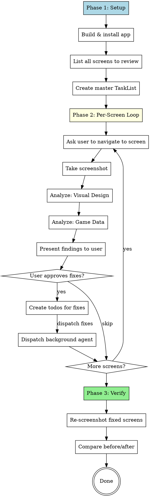

# Screen Polish Loop

## Overview

Unified screen-by-screen review process combining **visual design analysis** and **game design validation**. Build → Screenshot → Analyze (visual + game data) → Create todos → Dispatch fixes → Next screen.

## Quick Start

```
/screen-polish-loop
```

Then follow the process below from Phase 1.

## Process



## Phase 1: Setup

### Build & Install

```bash
# Build
DEVELOPER_DIR=/Applications/Xcode.app/Contents/Developer /Applications/Xcode.app/Contents/Developer/usr/bin/xcodebuild -project dynasty/dynasty.xcodeproj -scheme dynasty -destination 'platform=iOS Simulator,name=iPad Pro 13-inch (M5)' build 2>&1 | tail -3

# Boot + Install + Launch
DEVELOPER_DIR=/Applications/Xcode.app/Contents/Developer xcrun simctl boot 'iPad Pro 13-inch (M5)' 2>/dev/null
DEVELOPER_DIR=/Applications/Xcode.app/Contents/Developer xcrun simctl uninstall 'iPad Pro 13-inch (M5)' com.brewcrow.dynasty 2>/dev/null
DEVELOPER_DIR=/Applications/Xcode.app/Contents/Developer xcrun simctl install 'iPad Pro 13-inch (M5)' ~/Library/Developer/Xcode/DerivedData/dynasty-arklysztnruxtvfbogjmrinmtdqt/Build/Products/Debug-iphonesimulator/dynasty.app
DEVELOPER_DIR=/Applications/Xcode.app/Contents/Developer xcrun simctl launch 'iPad Pro 13-inch (M5)' com.brewcrow.dynasty
```

### Screen Inventory

Create a TaskList tracking all screens. Dynasty screens to review:

| # | Screen | View File | Priority |
|---|--------|-----------|----------|
| 1 | Main Menu | MainMenuView | High |
| 2 | New Career | NewCareerView | High |
| 3 | Team Selection | TeamSelectionView | High |
| 4 | Intro Sequence (5 steps) | IntroSequenceView | High |
| 5 | Career Dashboard | CareerDashboardView | Critical |
| 6 | Roster | RosterView | Critical |
| 7 | Player Detail | PlayerDetailView | High |
| 8 | Depth Chart | DepthChartView | Medium |
| 9 | Formation | FormationView | Medium |
| 10 | Coaching Staff | CoachingStaffView | High |
| 11 | Hire Coach | HireCoachView | Medium |
| 12 | Scouting Hub | ScoutingHubView | High |
| 13 | Prospect Detail | ProspectDetailView | Medium |
| 14 | Draft | DraftView | High |
| 15 | Contracts / Cap | PlayerContractView / CapOverviewView | High |
| 16 | Free Agency | FreeAgencyView | Medium |
| 17 | Trade Center | TradeView | Medium |
| 18 | Schedule | ScheduleView | Medium |
| 19 | Standings | StandingsView | Medium |
| 20 | Press Conference | PressConferenceView | Medium |
| 21 | Locker Room | LockerRoomView | Medium |
| 22 | News / Inbox | NewsView / InboxView | Low |

Use `TaskCreate` to create a task for each screen, starting with Critical and High priority.

## Phase 2: Per-Screen Analysis

### Take Screenshot

```bash
# Create screenshot directory if needed
mkdir -p /tmp/snd-screenshots

# Take screenshot (use descriptive filename)
DEVELOPER_DIR=/Applications/Xcode.app/Contents/Developer xcrun simctl io 'iPad Pro 13-inch (M5)' screenshot /tmp/snd-screenshots/SCREENNAME_v1.png
```

Then `Read` the screenshot file to view it.

### Visual Design Analysis (7 checks)

For each screenshot evaluate:

| Check | What to look for |
|-------|-----------------|
| **First Impression** | Professional? Clear hierarchy? Premium sports app feel? |
| **Typography** | Readable? Consistent weights? Monospaced numbers? Min 12pt? |
| **Spacing** | Consistent padding? Grid-aligned? Balanced whitespace? |
| **Color & Contrast** | Dark theme consistent? Gold accents purposeful? 4.5:1 contrast? Semantic colors? |
| **Cards & Components** | Consistent corner radius? Card backgrounds? Clear sections? Touch targets? |
| **Information Density** | Right amount? Key info prominent? Secondary info subdued? Empty states? |
| **Platform Feel** | iPad-native? Uses screen space well? Navigation feels right? |

### Game Design Analysis (5 checks)

For each screen also evaluate from a **game management simulation** perspective:

| Check | What to look for |
|-------|-----------------|
| **Essential Data** | Does the screen show ALL information a GM/HC needs to make decisions? |
| **Decision Support** | Can the player compare options? Are trade-offs visible? |
| **Feedback** | Does the screen show consequences of past decisions? Trends? |
| **Immersion** | Does it feel like running an NFL franchise? Atmosphere? |
| **Flow** | Can the player quickly do what they came here to do? Minimal friction? |

#### Essential Data Per Screen Type

- **Roster**: OVR, age, contract status, injury, depth chart position, trend arrows
- **Player Detail**: All attributes by category, contract details, history, comparable players
- **Draft/Scouting**: Projected round, combine stats, position need, scout grades, bust/boom %
- **Contracts**: Cap space, dead money, guarantees, years remaining, team-friendly indicator
- **Dashboard**: Current week, upcoming tasks, team record, morale, cap situation, news ticker
- **Coaching**: Scheme fit, coordinator ratings, position group grades, development bonuses

### Present Findings

Format findings as a structured report:

```
## [Screen Name] - Analysis

### Visual Issues
1. [Critical] Description...
2. [High] Description...
3. [Medium] Description...

### Game Data Issues
1. [Missing] Data X needed for decision Y
2. [Improve] Data Z should be more prominent
3. [Add] Feature W would help player flow

### Recommendation
Quick summary of what needs to change.
```

Ask user: **"Hyva? Aloitetaanko korjaukset?"**

### Create Todos & Dispatch

After user approval:

1. **TaskCreate** for each fix, grouped by screen
2. **Dispatch background Agent** (subagent_type: general-purpose) with:
   - The specific fixes to make
   - File paths to modify
   - Clear acceptance criteria
   - Instruction to NOT touch other screens

```
Agent prompt template:
"Fix the following issues in [ViewFile.swift]:
1. [Fix description]
2. [Fix description]
Do NOT modify any other files. After fixing, the screen should [acceptance criteria]."
```

3. **TaskUpdate** status to in_progress
4. Continue to next screen immediately (don't wait for agent)

## Phase 3: Verify

After all screens analyzed and agents have completed:

1. Rebuild the app
2. Re-screenshot each fixed screen (save as `SCREENNAME_v2.png`)
3. Compare v1 vs v2 side by side
4. Mark tasks as completed or create follow-up tasks
5. Run one final iteration if needed

## Fix Priority

1. **Critical**: Broken layout, unreadable text, missing essential game data
2. **High**: Poor hierarchy, missing decision-support data, inconsistent spacing
3. **Medium**: Alignment, font tweaks, padding, secondary data improvements
4. **Low**: Polish, micro-animations, atmosphere enhancements

## Session Continuity

This skill is designed to be **resumed across sessions**. At the start of any session:

1. Run `TaskList` to see current progress
2. Check which screens are done vs pending
3. Check if background agents completed their work
4. Continue from where you left off

## Rules

- Maximum 5 fix iterations per screen
- Each iteration: fix 3-5 issues max
- Always rebuild and re-screenshot after fixes
- Never modify screens not currently being reviewed
- Ask user before making game design changes (data additions)
- Visual-only fixes can be dispatched without asking
