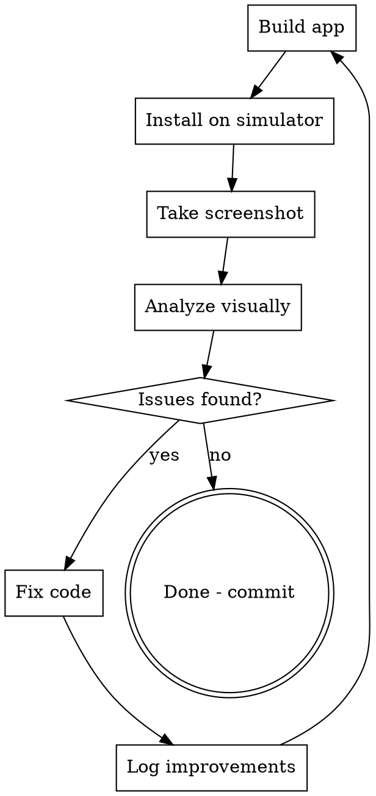

# Visual Design Loop

## Overview

Iterative visual quality improvement cycle: **Build → Screenshot → Analyze → Fix → Repeat**. Uses real simulator screenshots (not just code reading) to evaluate what the user actually sees.

## Process



## Commands

### Build
```bash
DEVELOPER_DIR=/Applications/Xcode.app/Contents/Developer /Applications/Xcode.app/Contents/Developer/usr/bin/xcodebuild -project dynasty/dynasty.xcodeproj -scheme dynasty -destination 'platform=iOS Simulator,name=iPad Pro 13-inch (M5)' build 2>&1 | tail -3
```

### Install + Launch (fresh, clears old data)
```bash
DEVELOPER_DIR=/Applications/Xcode.app/Contents/Developer xcrun simctl boot 'iPad Pro 13-inch (M5)' 2>/dev/null
DEVELOPER_DIR=/Applications/Xcode.app/Contents/Developer xcrun simctl uninstall 'iPad Pro 13-inch (M5)' com.brewcrow.dynasty 2>/dev/null
DEVELOPER_DIR=/Applications/Xcode.app/Contents/Developer xcrun simctl install 'iPad Pro 13-inch (M5)' ~/Library/Developer/Xcode/DerivedData/dynasty-arklysztnruxtvfbogjmrinmtdqt/Build/Products/Debug-iphonesimulator/dynasty.app
DEVELOPER_DIR=/Applications/Xcode.app/Contents/Developer xcrun simctl launch 'iPad Pro 13-inch (M5)' com.brewcrow.dynasty
```

### Screenshot
```bash
DEVELOPER_DIR=/Applications/Xcode.app/Contents/Developer xcrun simctl io 'iPad Pro 13-inch (M5)' screenshot /tmp/snd-screenshots/FILENAME.png
```

Then read the screenshot with the Read tool to see it visually.

### Navigate (ask user to tap, or use deep links if available)
Since xcrun simctl doesn't support reliable tap, ask the user to navigate to each screen manually, then take screenshots.

## Visual Analysis Checklist

For each screenshot, evaluate against these 7 categories:

### 1. First Impression (2-second test)
- Does it look professional or amateur?
- Is there a clear visual hierarchy?
- Does it feel like a premium sports app?

### 2. Typography
- Is text readable at all sizes?
- Consistent font weights (bold headers, regular body)?
- Numbers using monospaced digits?
- No text too small (< 12pt) or too large for its role?

### 3. Spacing & Alignment
- Consistent padding around cards?
- Elements aligned to grid?
- No cramped or overly spacious areas?
- Balanced whitespace?

### 4. Color & Contrast
- Dark theme consistent (no bright white flashes)?
- Gold accents used purposefully (not overused)?
- Text readable against backgrounds (4.5:1 contrast)?
- Semantic colors correct (green=good, red=bad)?

### 5. Cards & Components
- Consistent corner radius across all cards?
- Consistent card backgrounds?
- Clear separation between sections?
- Touch targets visually obvious?

### 6. Information Density
- Right amount of info per screen (not overwhelming)?
- Key information prominent?
- Secondary info appropriately subdued?
- Empty states handled?

### 7. Platform Feel
- Does it feel like an iPad app (not phone)?
- Content appropriately wide/centered?
- Uses iPad screen real estate well?
- Navigation patterns feel native?

## Fix Priority

1. **Critical**: Broken layout, unreadable text, missing content
2. **High**: Poor hierarchy, inconsistent spacing, wrong colors
3. **Medium**: Alignment issues, font weight tweaks, padding adjustments
4. **Low**: Polish details, micro-animations, subtle refinements

## Iteration Rules

- Maximum 5 iterations per screen (avoid infinite loops)
- Each iteration should fix 3-5 issues maximum
- Always rebuild and re-screenshot after fixes
- Compare before/after screenshots
- Stop when the screen looks professional to a critical eye

## Output

After completing the loop, provide:
- Before/after comparison notes
- List of all changes made per file
- Overall quality assessment (1-10 scale)
